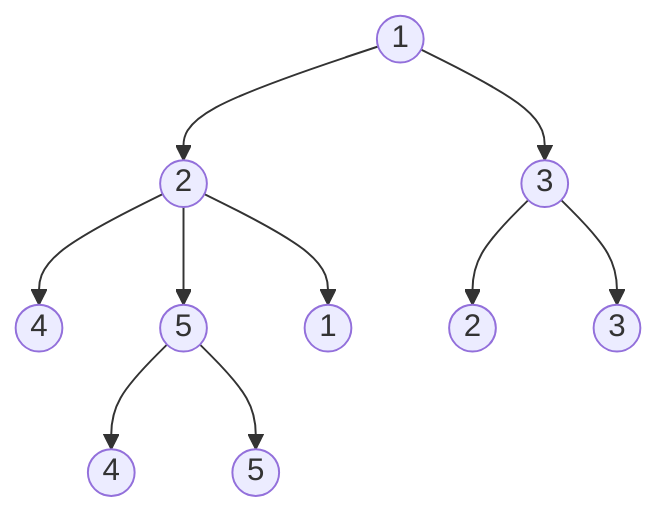
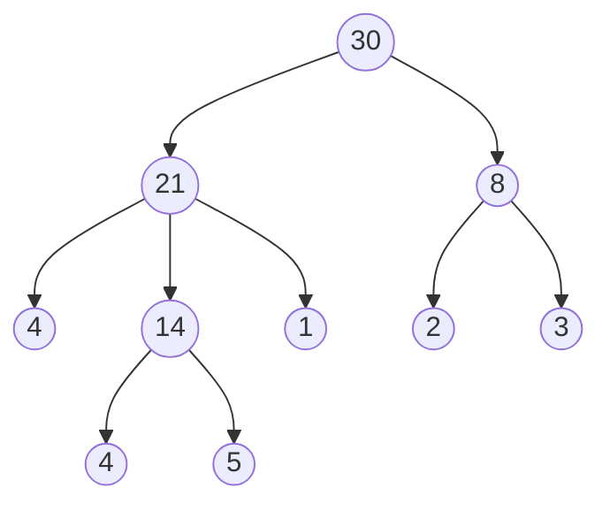
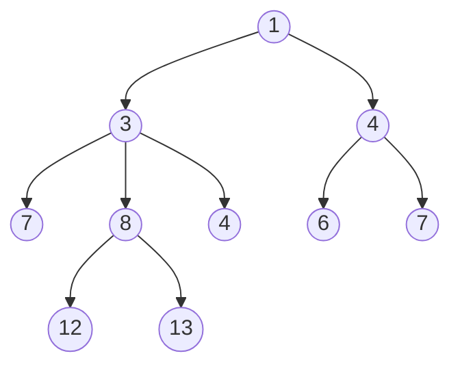

# 前缀和

前缀和可以简单理解为数列的前 $n$ 项的和，是一种重要的预处理方式，能大大降低查询的时间复杂度。[^1]

[^1]: 前缀和 & 差分，oi-wiki，<https://oi-wiki.org/basic/prefix-sum/>

## 1. 前缀和定义

前缀和数组 $b[i]$ 的值为原数组 $a[i]$ 前 $i$ 项的和，其简单实现如下：

::: code-tabs#code

@tab cpp

```cpp
int a[10001], b[10001];

void prefix_sum(int n) {
    b[0] = a[0];
    for (int i = 1; i < n; i++)
        b[i] = b[i - 1] + a[i];
}
```

@tab python

```python
def prefix_sum(a: list[int]) -> list[int]:
    n = len(a)
    b = [0] * n
    b[0] = a[0]
    for i in range(n):
        b[i] = a[i] + b[i - 1]
    return b
```

:::

与前缀和相对于的逆运算叫做 **差分**，即不断求前后两项的差，可以阅读 [差分数组](./difference-arrays.md) 了解更多。

## 2. 前缀和的推广

### 2.1 后缀和

与前缀和相反的，最后 $i$ 项的和被定义为后缀和，其简单实现如下：

::: code-tabs#code

@tab cpp

```cpp
int a[10001], b[10001];

void suffix_sum(int n) {
    b[n - 1] = a[n - 1];
    for (int i = n - 2; i >= 0; i--)
        b[i] = b[i + 1] + a[i];
}
```

@tab python

```python
def suffix_sum(a: list[int]) -> list[int]:
    n = len(a)
    b = [0] * n
    b[n - 1] = a[n - 1]
    for i in range(n - 2, -1, -1):
        b[i] = a[i] + b[i + 1]
    return b
```

:::

### 2.2 前缀操作

如果从数组第二项开始，对当前值和原数组进行一种操作，由此产生的问题也可以看做是前缀和问题。上面的前缀和也是这种问题的一个子集，这种操作可以由某函数定义，如果操作如果是加则是经典的前缀和，如果是乘则是前缀积，以此类推。

## 3. 其他形式的前缀和

### 3.1 二维前缀和

首先我们讨论二维前缀和，举例下列矩阵

$$
M = \begin{bmatrix}
    1 & 2 & 4 & 3 \\
    5 & 1 & 2 & 4 \\
    6 & 3 & 5 & 9
\end{bmatrix}
$$

矩阵 $M$ 可以被视为二维数组。其二维的前缀和 $S$ 定义为：

$$
S_{x,y} = \sum_{i=1}^x\sum_{j=1}^y M_{i,j}
$$

其值为

$$
S = \begin{bmatrix}
    1  & 3  & 7  & 10 \\
    6  & 9  & 15 & 22 \\
    12 & 18 & 29 & 45
\end{bmatrix}
$$

设矩阵的大小为 $m \times n$，如果按照公式去解，将产生 $\mathcal{O}(m^2n^2)$ 的复杂度。我们可以使用动态规划的思想，保留之前求过的值。

而 $S_{x-1,y} + S_{x,y-1}$ 将对 $S_{x-1,y-1}$ 加了两次，我们运用容斥原理的多退少补的思想，进行去重，这样得到了基本的公式 $S_{x,y} = S_{x-1,y} + S_{x,y-1} - S_{x-1,y-1} + M_{x,y}$，其标准的定义为：

$$
S_{x,y} = \begin{cases}
    M_{1,1}, & x = 1 \text{ and } y = 1 \\
    S_{x-1,y} + S_{x,y-1} - S_{x-1,y-1} + M_{x,y}, & \text{otherwise}
\end{cases}
$$

这样通过一次遍历就可以得到其值，时间复杂度为 $\mathcal{O}(mn)$，如果不需要保留原数组可以直接进行原地操作。

### 3.2 高维前缀和

基于容斥原理来计算高维前缀和的方法，其优点在于形式较为简单，但当维数升高时，其复杂度较高。这里给出一种基于动态规划计算高维前缀和的方法，可显著降低高维前缀和问题的复杂度。

*@TODO* 待完成。

### 3.3 树形前缀和

树有两种遍历方向，这也就带来了两种不同的问题，我们以下面的树为例（点权）：



设 $a_i$ 表示结点 $i$ 和所有子结点的权值总和，那么对树进行一次遍历（顺序任意，先遍历子结点即可）即可得到 $a_i$。



在上面的情况中，新的树根即为所有结点的和。如果这个求和操作进行推广到任意操作，这就是树形 DP 问题，即树形动态规划。

设 $s_i$ 表示结点 $i$ 到根节点的权值总和，那么对树进行一次遍历（顺序任意，先遍历父结点即可）即可得到 $s_i$。



有下列结论：
- 若是点权，$x \to y$ 路径上的和为 $s_x + s_y - s_{\mathrm{LCA}(x,\,y)} - s_{\mathrm{FA}(\mathrm{LCA}(x,\,y))}$
- 若是边权，$x \to y$ 路径上的和为 $s_x + s_y - 2s_{\mathrm{LCA}(x,\,y)}$

其中 $\mathrm{LCA}(x,\,y)$ 表示结点 $x,\,y$ 的最近公共祖先，$\mathrm{FA}(x)$ 表示其父结点，如果没有父结点则此项为 $0$。

我们可以发现，点权的情况和边权的情况差了一个 $\mathrm{LCA}(x,\,y)$ 的值，因为最佳公共祖先的结点会被算两遍，所以需要减两遍，而点权的情况会将这个结点自身的值也减掉，所以需要减其父结点。

## 5. 标准库实现

前缀和实现比较简单，也可以完全自行实现。

::: tabs#code

@tab cpp

C++ 标准库中实现了前缀和函数 `std::partial_sum`，定义于头文件 `<numeric>` 中。

注意其在 C++ 20 前声明如下：

```cpp
template< class InputIt, class OutputIt >
OutputIt partial_sum( InputIt first, InputIt last, OutputIt d_first );

template< class InputIt, class OutputIt, class BinaryOperation >
OutputIt partial_sum( InputIt first, InputIt last, OutputIt d_first,
                      BinaryOperation op );
```

而 C++ 20 后其声明如下：

```cpp
template< class InputIt, class OutputIt >
constexpr OutputIt partial_sum( InputIt first, InputIt last, OutputIt d_first );

template< class InputIt, class OutputIt, class BinaryOperation >
constexpr OutputIt partial_sum( InputIt first, InputIt last, OutputIt d_first,
                                BinaryOperation op );
```

`std::partial_sum` 不仅可以实现前缀和，也可以实现前缀积等操作：

```cpp
std::vector<int> v(10, 2);
// 2, 2, 2, 2, 2, 2, 2, 2, 2, 2
std::partial_sum(v.begin(), v.end(), v.begin(), std::multiplies<int>());
// 2, 4, 8, 16, 32, 64, 128, 256, 512, 1024
```

@tab python

Python 包含前缀和类 `itertools.accumulate`，其接受一个 `Iterable` 对象，返回一个 `Iterable` 对象（即不会立即求值）：

```python
from itertools import accumulate

print(list(accumulate([1, 2, 3, 4, 5])))
```

`itertools.accumulate` 也可以实现前缀积等操作：

```python
from itertools import accumulate
from operator import mul

print(list(accumulate([2] * 10, mul)))
# 2, 4, 8, 16, 32, 64, 128, 256, 512, 1024
```

:::
