# 1. 绪论

[[TOC]]

## 1.1 什么是编译

### 1.1.1 计算机程序设计语言及编译

*@def* **高级语言**（High-level Programming 是一种独立于机器，面向过程或对象的语言。高级语言是参照数学语言而设计的近似于日常会话的语言。[^1]

[^1]: 高级语言，百度百科，<https://baike.baidu.com/item/%E9%AB%98%E7%BA%A7%E8%AF%AD%E8%A8%80>

*@def* **汇编语言**（Assembly Language）是任何一种用于电子计算机、微处理器、微控制器，或其他可编程器件的低级语言。在不同的设备中，汇编语言对应着不同的机器语言指令集。一种汇编语言专用于某种计算机系统结构，而不像许多高级语言，可以在不同系统平台之间移植。[^2]

[^2]: 汇编语言，维基百科，<https://zh.wikipedia.org/wiki/%E6%B1%87%E7%BC%96%E8%AF%AD%E8%A8%80>

*@TODO* 首先，我们比较各种不同层次语言的特点：

- 高级语言
    - 编写简单，不依赖特定机器
    - 如 `x = 2`
- 汇编语言
    - 编写复杂，需要了解特定机器
    - 如 `mov x 0002`
- 机器语言
    - 可以被计算机直接理解的语言
    - 如 `C706 0000 0002`

*@def* **编译**（Compile）：将 **高级语言** 翻译成 **汇编语言** 或者 **机器语言** 的过程。

*@def* **编译器**（Compiler）即处理编译过程的程序。换句话说，编译器是将一种语言（通常为高级语言）翻译为另一种语言（通常为低级语言）的程序。

### 1.1.2 编译器在语言处理系统中的位置

编译过程在语言处理系统中的作用可以用下图表示：


*@def* **可重定位的机器代码**（Relocatable）：这种机器代码在内存中存放的起始位置 $L$ 不是固定的。

*@def* **外部地址**（External Address）：一个过程中的代码可能引用另一个文件的数据对象或过程，这些数据对象或过程的地址对于这个文件来说是外部地址。

**预处理器** 的功能：
- 把储存在不同文件中的源程序 *聚合* 在一起
- 把 **宏**（Macro）转换为原始语句

**加载器** 的功能：
- 修改可重定位地址，将修改后的指令和数据放到内存的适当位置
- 计算地址公式：$\text{起始位置} + \text{相对地址} = \text{绝对地址}$

**链接器** 的功能：
- 将多个可重定位的机器代码文件（包括库文件）连接到一起
- 解决外部内存地址问题

## 1.2 编译系统的结构

### 1.2.1 人工英汉翻译的例子

如何翻译 `"In his room, he broke a window with a hammer."` ？

### 1.2.2 编译器的结构

$$
\begin{aligned}
    \text{源语言} &\rightarrow& \text{句子的语义}\;
    &\rightarrow&
    \text{目标语言} \\
    & (1) & \text{(中间语言)}\; & \;(2) &
\end{aligned}
$$

1. 分析源语言过程
    1. *@def* **语义分析**（Semantic Analysis）
    2. *@def* **语法分析**（Syntax Analysis）
    3. *@def* **词法分析**（Lexical Analysis）
2. 生成目标语言

示意图：


*@def* **编译前端**（Front End）又叫分析部分，与 *源语言* 相关。

*@def* **编译后端**（Back End）又叫综合部分，与 *目标语言* 相关。

*@def* **语法制导翻译**（Syntax-Directed Translation）指在解析输入的字符串时，在特定位置执行指定的动作。换言之，根据语法把输入的字符串 *翻译* 为一串动作，故名 *语法制导翻译*。编译过程多个过程是绑定在一起的。

## 1.3 词法分析概述

### 1.3.1 词法分析的作用

词法分析器的作用：
- 从左到右扫描源程序的字符，识别出各个单词，确定单词的类型
- 将识别出的单词转换为统一的 *机内表示* —— **词法单元**（Token）的形式

一个词法单元 `token` 可以表示为 $<\text{种别码},\, \text{属性值}>$。

| 单词类型 |                  种别                  |       种别码        |
| :------: | :------------------------------------: | :-----------------: |
|  关键字  |  `program`、`if`、`else`、`then`、...  |      一词一码       |
|  标识符  |  变量名、数组名、记录名、过程名、...   |      多词一码       |
|   常量   |   整型、浮点型、字符型、布尔型、...    |      一型一码       |
|  运算符  | 算术（`+ - * / ++ --`）关系、逻辑、... | 一词一码 / 一型一码 |
|  界限符  |           `; ( ) = { } `...            |      一词一码       |

### 1.3.2 词法分析后得到的 token 序列

例如，分析下面的语句：

```c
while (value != 100) {
    num++;
}
```

词法分析的输出结果如下：

```log:no-line-numbers
 1.  while  <WHILE, - >
 2.  (      <SLP, - >
 3.  value  <IDN, value>
 4.  !=     <NE, - >
 5.  100    <CONST, 100>
 6.  )      <SRP, - >
 7.  {      <LP, - >
 8.  num    <IDN, num>
 9.  ++     <INC, - >
10.  ;      <SEMI, - >
11.  }      <RP, - >
```

## 1.4 语法分析概述

### 1.4.1 语法分析器

*@def* **语法分析器**（Parser）：从词法分析器输出的 token 序列中识别出各类短语，并构造 **语法分析树**（Parse Tree）。

### 1.4.2 赋值语句分析树

例如：

```c
position = initial + rate * 60;
```

序列为：`<id, position>`，`<=>`，`<id, initial>`，`<+>`，`<id, rate>`，`<*>`，`<num, 60>`，`<;>`。

赋值语句的解析结构如下：



### 1.4.3 变量声明语句的分析树

*@def* **变量声明语句文法**：

$$
\begin{aligned}
    \text{<D>} & \rightarrow  \text{<T><IDS>;} \\
    \text{<T>} & \rightarrow \text{int | real | char | bool} \\
    \text{<IDS>}&\rightarrow \text{id | <IDS>, id}
\end{aligned}
$$

输入：

```c
int a, b, c;
```

解析出的语法树如下：



## 1.5 语义分析概述

### 1.5.1 语义分析的主要任务

语义分析的主要任务是：
1. 收集标识符的属性信息
2. 进行语义检查

### 1.5.2 收集标识符的属性信息

收集标识符的属性信息是语义分析的主要任务，而标识符的属性包括：
- **种型**（Kind）
- **类型**（Type）
- **储存位置、长度**
- 值
- 作用域
- 参数和返回值信息

```pascal
begin
    real x[8];
    integer i, j;
    ......
end
```

| 名字  | 相对地址 |
| :---: | :------: |
|  `x`  |   `0`    |
|  `i`  |   `64`   |
|  `j`  |   `68`   |

### 1.5.3 语义检查

语义检查：

1. 变量或过程未经声明
2. 变量或过程重复声明
3. 运算分量类型不匹配
4. 操作符和操作符不匹配
    - 数组下标不是整数
    - 对非数组变量使用数组访问操作符
    - 对非过程名使用过程调用操作符
    - 过程调用的参数类型或数目不匹配
    - 函数返回类型有误

## 1.6 中间代码生成和编译器后端

### 1.6.1 常用的中间表示形式

常用的中间表示形式：

*@def* **三地址码**（Three-Address Code）是由 *类似于汇编语言* 的指令序列组成，其每个指令最多有三个 **操作数**（Operand）。

*@def* **语法树**（Syntax Tree）：也称为 **语法结构树** *@TODO*

常见三地址码：

| 指令类型       | 指令形式                       |
| -------------- | ------------------------------ |
| 赋值指令       | `x = y op z` / `x = op y`      |
| 复制指令       | `x = y`                        |
| 条件跳转       | `if x relop y goto n`          |
| 非条件跳转     | `goto n`                       |
| 参数传递       | `param x`                      |
| 过程调用       | `call p, n`                    |
| 过程返回       | `return x`                     |
| 数组引用       | `x = y[i]`                     |
| 数组赋值       | `x[i] = y`                     |
| 地址及指针操作 | `x = &y` / `x = *y` / `*x = y` |

地址可能具有如下形式：

- 源程序中的 **名字**（Name）
- **常量**（Constant）
- 编译器生成的 **临时变量**（Temporary Variable）

三地址指令的表示：

- **四元式**（Quadruples），即 `(op, y, z, x)`
- **三元式**（Triples）
- **间接三元式**（Indirect Triples）

以上三地址指令的四元式表示：

| 三地址指令            | 四元式              |
| --------------------- | ------------------- |
| `x = y op z`          | `(op, y, z, x)`     |
| `x = op y`            | `(op, y, _, x)`     |
| `x = y`               | `(=, y, _, x)`      |
| `if x relop y goto n` | `(relop, x, y, n)`  |
| `goto n`              | `(goto, _, _, n)`   |
| `param x`             | `(param, _, _, x)`  |
| `call p, n`           | `(call, p, n, _)`   |
| `return x`            | `(return, _, _, x)` |
| `x = y[i]`            | `(=[], y, i, x)`    |
| `x[i] = y`            | `([]=, y, x, i)`    |
| `x = &y`              | `(&, y, _, x)`      |
| `x = *y`              | `(=*, y, _, x)`     |
| `*x = y`              | `(*=, y, _, x)`     |

### 1.6.2 中间代码生成的例子

```vb
while a < b do
    if c < 5 then
        while x > y do
            z = x + 1;
    else x = y;
```

三地址码表示（`j` 表示跳转指令）

```log:no-line-numbers
100: (j<, a, b, 102)
101: (j , -, -, 112)
102: (j<, c, 5, 104)
103: (j , -, -, 110)
104: (j>, x, y, 106)
105: (j , -, -, 100)
106: (+ , x, 1, t1 )
107: (= , t1, -, z )
108: (j , -, -, 104)
109: (j , -, -, 100)
110: (= , y, -, x  )
111: (j , -, -, 100)
112: 
```

### 1.6.3 目标代码生成

**目标代码生成** 的一个重要任务是为程序中使用的变量 *合理分配寄存器*。

*@def* **代码优化**（Code Optimization），为改进代码所进行的等价程序变换，使其运行得更快一些，占用空间更小一些。
