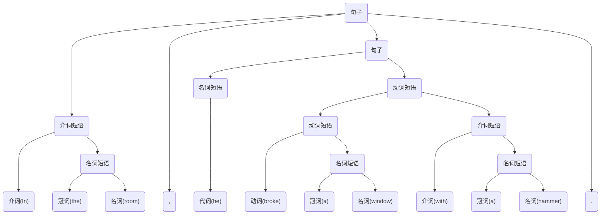
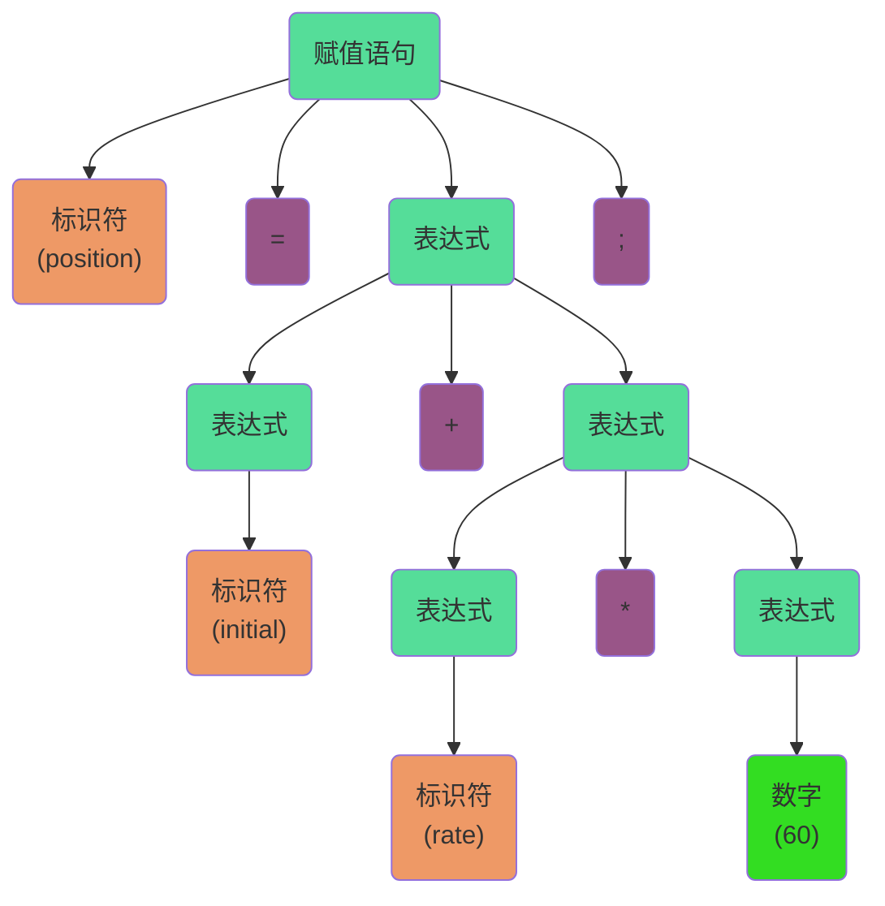
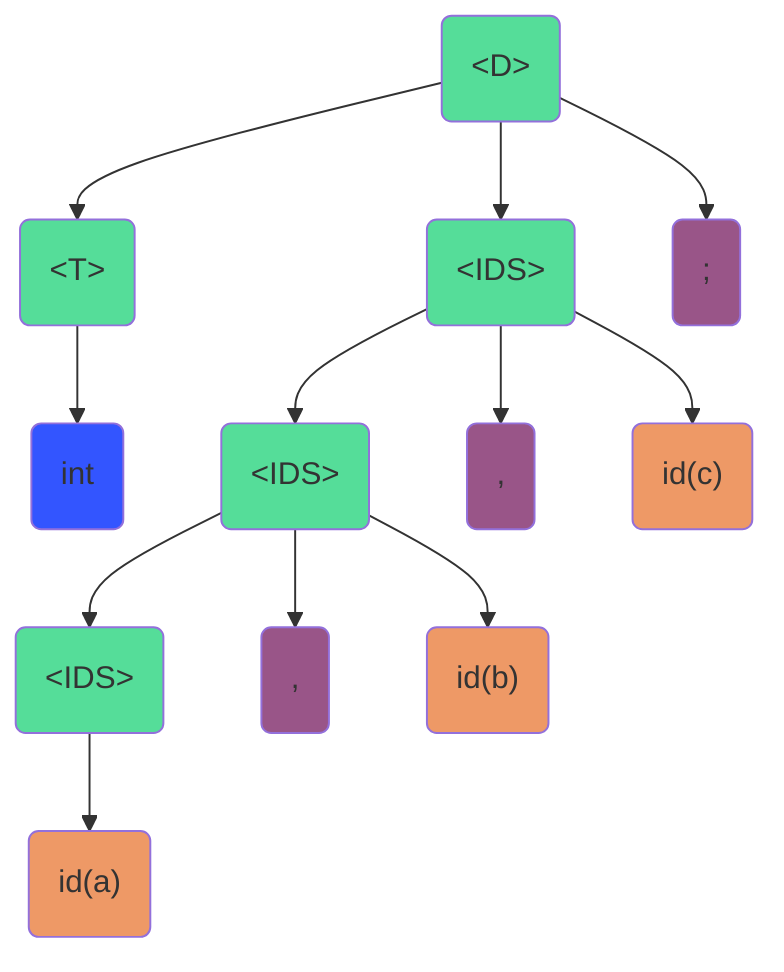

# 1. 绪论

[[TOC]]

## 1.1 什么是编译

### 1.1.1 计算机程序设计语言及编译

首先，我们先了解和比较各种不同层次的语言。

*@def* **机器语言**（Machine Language）机器语言是机器能直接识别的程序语言或指令代码，无需经过翻译，每一操作码在计算机内部都有相应的电路来完成它，或指不经翻译即可为机器直接理解和接受的程序语言或指令代码。[^1]

[^1]: 机器语言，百度百科，<https://baike.baidu.com/item/%E6%9C%BA%E5%99%A8%E8%AF%AD%E8%A8%80>

机器语言可以直接被计算机理解，所以在最早期的机器使用的一般都是机器语言。但机器语言只能使用二进制指令（一般使用十六进制表示）表示，这些数字通常不能直接看出其含义，因此使用机器语言编写和阅读程序都是极其困难的。

例如，这是一段十六进制表示的机器语言代码：`C706 0000 0002`，我们如果不知道其指令集架构等信息，我们无法看出其含义。

下面总结，使用机器语言的缺点：
- 与人类的表达习惯相去甚远
- 难记忆
- 难编写、难阅读
- 易写错

正是因为机器语言的诸多缺点，我们引入了 **助记符**（Mnemonic）。用符号代替了机器指令代码，例如 `MOV X, 2` 表示将立即数 `2` 赋值给 `X`，由此引入了汇编语言。`MOV` 表示 *移入*（move），而 `X` 代表一个地址。

*@def* **汇编语言**（Assembly Language）是任何一种用于电子计算机、微处理器、微控制器或其他可编程器件的低级语言，亦称为符号语言。在汇编语言中，用助记符代替机器指令的操作码，用地址符号或标号代替指令或操作数的地址。在不同的设备中，汇编语言对应着不同的机器语言指令集，通过汇编过程转换成机器指令。特定的汇编语言和特定的机器语言指令集是一一对应的，不同平台之间不可直接移植。[^2]

[^2]: 汇编语言，百度百科，<https://baike.baidu.com/item/%E6%B1%87%E7%BC%96%E8%AF%AD%E8%A8%80>

但是汇编语言也有其缺点：
- 依赖于特定机器，分计算机专业人员使用受限
- 编写效率比较低

为了简化编写程序的流程，我们提出了更接近于自然语言的表达方式。

*@def* **高级语言**（High-level Programming 是一种独立于机器，面向过程或对象的语言。高级语言是参照数学语言而设计的近似于日常会话的语言。[^3]

[^3]: 高级语言，百度百科，<https://baike.baidu.com/item/%E9%AB%98%E7%BA%A7%E8%AF%AD%E8%A8%80>

高级语言以一种类似数学语言的简洁形式，更加接近人的表达习惯。例如 `x = 2`，它可以完成上述汇编语句或者机器语言的功能。高级语言编写简单，不依赖特定机器。高级语言的编写效率较高。

*@def* **汇编**（Assembling）：将汇编语言翻译为机器语言的过程。

*@def* **编译**（Compile）：将高级语言翻译成汇编语言或者机器语言的过程。前者（高级语言）被称为 **源语言**，后者被称为 **目标语言**。

*@def* **编译器**（Compiler）即处理编译过程的程序。换句话说，编译器是将一种语言（通常为高级语言）翻译为另一种语言（通常为低级语言）的程序。

编译原理课程即学习编译器如何将高级语言翻译为汇编语言或机器语言的过程。

### 1.1.2 编译器在语言处理系统中的位置

编译过程在语言处理系统中的作用可以用下图表示：



**预处理器** 的功能：
- 把储存在不同文件中的源程序 *聚合* 在一起
- 把 **宏**（Macro）转换为原始语句

**加载器** 的功能：
- 修改可重定位地址，将修改后的指令和数据放到内存的适当位置
- 计算地址公式：*起始位置 + 相对地址 = 绝对地址*

**链接器** 的功能：
- 将多个可重定位的机器代码文件（包括库文件）连接到一起
- 解决外部内存地址问题

*@def* **可重定位的机器代码**：当机器代码在内存中存放的起始位置 $L$ 不是固定的，我们称之为 **可重定位的**（Relocatable）。

*@def* **外部内存地址**：一般指的是一个过程中的代码可能引用另一个文件的数据对象或过程，这些数据对象或过程的地址对于这个文件来说是外部地址。

## 1.2 编译系统的结构

### 1.2.1 人工英汉翻译的例子

如何翻译 `In his room, he broke a window with a hammer.`？

在此时，英语是源语言，中文是目标语言。通常翻译可以分为两步：

1. 分析源语言
2. 生成目标语言

$$
\begin{aligned}
    \text{源语言的句子} &\rightarrow& \text{句子的语义}\;
    &\rightarrow&
    \text{目标语言的句子} \\
    & (1) & \text{(中间语言)}\; & \;(2) &
\end{aligned}
$$

分析源语言的过程即语义分析的过程，下面我们分析这个句子，得到这个句子的语义为：

<!-- ```mermaid
mindmap
    root((事件))
        主体
            他
        借助于
            锤子
        作用对象
            窗户
        状态
            在房间内
        动作
            敲碎了
``` -->

语义和语言无关，可以用于表示任何一种自然语言的句子（上图只是一种表示，只用于示意）。

在语义分析中，需要划分句子成分，这一过程需要识别句子中的各类短语，这一过程称为语法分析，语法分析的结果为：

| 短语            | 成分 | 短语类型 |
| --------------- | ---- | -------- |
| `In his room`   | 状语 | 介词短语 |
| `he`            | 主语 | 名词     |
| `broke`         | 谓语 | 动词短语 |
| `a window`      | 宾语 | 名词     |
| `with a hammer` | 补语 | 介词     |

那么我们根据什么来识别句子中的各类短语呢？我们通过词性分析可以得出各类短语，这一过程被称为词法分析。词法分析的结果为：

| 单词     | 词性缩写 | 词性 |
| -------- | -------- | ---- |
| `In`     | *prep.*  | 介词 |
| `his`    | *art.*   | 冠词 |
| `room`   | *n.*     | 名词 |
| `,`      | -        | 逗号 |
| `he`     | *pron.*  | 代词 |
| `broke`  | *v.*     | 动词 |
| `a`      | *art.*   | 冠词 |
| `window` | *n.*     | 名词 |
| `with`   | *prep.*  | 介词 |
| `a`      | *art.*   | 冠词 |
| `hammer` | *n.*     | 名词 |
| `.`      | -        | 句号 |

由此，我们得出了翻译的基本流程。

1. 分析源语言
    1. 词法分析：得到各个词的词性
    2. 语法分析：分析出句子中的各类短语
    3. 语义分析：得到这个句子的语义，生成中间表示形式
2. 生成目标语言，通过中间表示形式把句子生成到目标语言

### 1.2.2 编译器的结构

类比编译原理，下面定义几个基本概念：

*@def* **词法分析**（Lexical Analysis）：字符序列转换为单词（Token）序列的过程。

*@def* **语法分析**（Syntax Analysis）：单词序列组合成各类语法短语。

*@def* **语义分析**（Semantic Analysis）：对源程序作出解释，获取句子语义的过程。

编译器工作流程意图：



*@def* **编译前端**（Front End）又叫分析部分，与 *源语言* 相关。

*@def* **编译后端**（Back End）又叫综合部分，与 *目标语言* 相关。

::: info 逻辑阶段

这里的每一个结点代表一个 **阶段**，是逻辑上的过程，而实际实现中多个阶段可能组织在一起。

:::

编译过程多个过程可能是绑定在一起的。例如在语法分析时结合语义规则可以对句子进行语义分析，这种技术叫做 **语法指导翻译**，下面给出其定义。

*@def* **语法制导翻译**（Syntax-Directed Translation）指在解析输入的字符串时，在特定位置执行指定的动作。换言之，根据语法把输入的字符串 *翻译* 为一串动作，故名 *语法制导翻译*。

## 1.3 词法分析概述

### 1.3.1 词法分析的主要任务

词法分析的主要任务：
- 从左到右扫描源程序的字符，识别出各个单词，确定单词的类型
- 将识别出的单词转换为统一的 *机内表示* —— 即 **词法单元** 的形式

*@def* **词法单元**（Token）：是一个包含词的种别和其属性的二元组。下文用 token 代指，token 可以表示为 $<\text{种别码},\, \text{属性值}>$。

种别码和单词的类型也不是一一对应的，例如某种语言的单词和其种别码对应关系：

| 单词类型 |                  种别                  |       种别码        |
| :------: | :------------------------------------: | :-----------------: |
|  关键字  |  `program`、`if`、`else`、`then`、...  |      一词一码       |
|  标识符  |  变量名、数组名、记录名、过程名、...   |      多词一码       |
|   常量   |   整型、浮点型、字符型、布尔型、...    |      一型一码       |
|  运算符  | 算术（`+ - * / ++ --`）关系、逻辑、... | 一词一码 / 一型一码 |
|  界限符  |           `; ( ) = { } `...            |      一词一码       |

### 1.3.2 词法分析后得到的 token 序列

例如，分析下面的 C 语言语句：

```c
while (value != 100) {
    num++;
}
```

词法分析的输出结果如下：

```log:no-line-numbers
 1.  while  <WHILE, - >
 2.  (      <SLP, - >
 3.  value  <IDN, value>
 4.  !=     <NE, - >
 5.  100    <CONST, 100>
 6.  )      <SRP, - >
 7.  {      <LP, - >
 8.  num    <IDN, num>
 9.  ++     <INC, - >
10.  ;      <SEMI, - >
11.  }      <RP, - >
```

其中 `<WHILE, - >` 表示一个 token，`WHILE` 是一个种别码，而其属性值为空。

## 1.4 语法分析概述

### 1.4.1 语法分析器

*@def* **语法分析器**（Parser）：从词法分析器输出的 token 序列中识别出各类短语，并构造 **语法分析树**。

*@def* **语法分析树**（Parse Tree）描述了语句子的具体结构。例如上一节的英语翻译为中文的例子中，语法分析树可以表示为：



::: details Mermaid 图示



:::

### 1.4.2 赋值语句分析树

例如：

```c
position = initial + rate * 60;
```

序列为：`<id, position>`，`<=>`，`<id, initial>`，`<+>`，`<id, rate>`，`<*>`，`<num, 60>`，`<;>`。

赋值语句的解析结构如下：



### 1.4.3 变量声明语句的分析树

*@def* **变量声明语句文法**：

$$
\begin{aligned}
    \text{<D>} & \rightarrow  \text{<T><IDS>;} \\
    \text{<T>} & \rightarrow \text{int | real | char | bool} \\
    \text{<IDS>}&\rightarrow \text{id | <IDS>, id}
\end{aligned}
$$

输入：

```c
int a, b, c;
```

解析出的语法树如下：



## 1.5 语义分析概述

### 1.5.1 语义分析的主要任务

语义分析的主要任务是：
1. 收集标识符的属性信息
2. 进行语义检查

### 1.5.2 收集标识符的属性信息

收集标识符的属性信息是语义分析的主要任务，而标识符的属性包括：
- **种型**（Kind）
- **类型**（Type）
- **储存位置、长度**
- 值
- 作用域
- 参数和返回值信息

```pascal
begin
    real x[8];
    integer i, j;
    ......
end
```

| 名字  | 相对地址 |
| :---: | :------: |
|  `x`  |   `0`    |
|  `i`  |   `64`   |
|  `j`  |   `68`   |

### 1.5.3 语义检查

语义检查：

1. 变量或过程未经声明
2. 变量或过程重复声明
3. 运算分量类型不匹配
4. 操作符和操作符不匹配
    - 数组下标不是整数
    - 对非数组变量使用数组访问操作符
    - 对非过程名使用过程调用操作符
    - 过程调用的参数类型或数目不匹配
    - 函数返回类型有误

## 1.6 中间代码生成和编译器后端

### 1.6.1 常用的中间表示形式

常用的中间表示形式：

*@def* **三地址码**（Three-Address Code）是由 *类似于汇编语言* 的指令序列组成，其每个指令最多有三个 **操作数**（Operand）。

*@def* **语法树**（Syntax Tree）：也称为 **语法结构树** *@TODO*

常见三地址码：

| 指令类型       | 指令形式                       |
| -------------- | ------------------------------ |
| 赋值指令       | `x = y op z` / `x = op y`      |
| 复制指令       | `x = y`                        |
| 条件跳转       | `if x relop y goto n`          |
| 非条件跳转     | `goto n`                       |
| 参数传递       | `param x`                      |
| 过程调用       | `call p, n`                    |
| 过程返回       | `return x`                     |
| 数组引用       | `x = y[i]`                     |
| 数组赋值       | `x[i] = y`                     |
| 地址及指针操作 | `x = &y` / `x = *y` / `*x = y` |

地址可能具有如下形式：

- 源程序中的 **名字**（Name）
- **常量**（Constant）
- 编译器生成的 **临时变量**（Temporary Variable）

三地址指令的表示：

- **四元式**（Quadruples），即 `(op, y, z, x)`
- **三元式**（Triples）
- **间接三元式**（Indirect Triples）

以上三地址指令的四元式表示：

| 三地址指令            | 四元式              |
| --------------------- | ------------------- |
| `x = y op z`          | `(op, y, z, x)`     |
| `x = op y`            | `(op, y, _, x)`     |
| `x = y`               | `(=, y, _, x)`      |
| `if x relop y goto n` | `(relop, x, y, n)`  |
| `goto n`              | `(goto, _, _, n)`   |
| `param x`             | `(param, _, _, x)`  |
| `call p, n`           | `(call, p, n, _)`   |
| `return x`            | `(return, _, _, x)` |
| `x = y[i]`            | `(=[], y, i, x)`    |
| `x[i] = y`            | `([]=, y, x, i)`    |
| `x = &y`              | `(&, y, _, x)`      |
| `x = *y`              | `(=*, y, _, x)`     |
| `*x = y`              | `(*=, y, _, x)`     |

### 1.6.2 中间代码生成的例子

```vb
while a < b do
    if c < 5 then
        while x > y do
            z = x + 1;
    else x = y;
```

三地址码表示（`j` 表示跳转指令）

```log:no-line-numbers
100: (j<, a, b, 102)
101: (j , -, -, 112)
102: (j<, c, 5, 104)
103: (j , -, -, 110)
104: (j>, x, y, 106)
105: (j , -, -, 100)
106: (+ , x, 1, t1 )
107: (= , t1, -, z )
108: (j , -, -, 104)
109: (j , -, -, 100)
110: (= , y, -, x  )
111: (j , -, -, 100)
112: 
```

### 1.6.3 目标代码生成

**目标代码生成** 的一个重要任务是为程序中使用的变量 *合理分配寄存器*。

*@def* **代码优化**（Code Optimization），为改进代码所进行的等价程序变换，使其运行得更快一些，占用空间更小一些。
