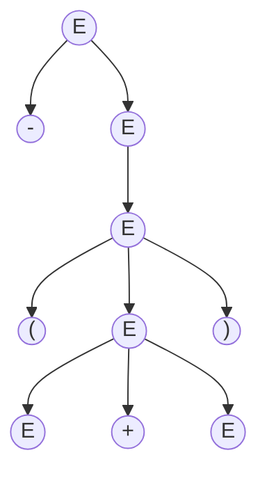

<!-- 写作指导：

本文档由 MarkDown + LaTeX 数学公式编写，如果你正在编辑这份文档，请参考 `docs/compilation-principle/gen_tool.py` 提供的帮助，提高工作效率。

-->

# 2. 程序设计语言及其文法

[[TOC]]

## 2.1 词法语法分析基本概念

### 2.1.1 字母表

*@def* **字母表**（Alphabet）是一个有穷符号集合，表示为 $\Sigma$。符号可以是：字母、数字、标点……

例如，二进制字母表 $\{0,\,1\}$、ASCII 字符集、Unicode 字符集。

### 2.1.2 字母表上的运算

*@def* 字母表的 **乘积**（Product）定义为：

$$
\Sigma _1\Sigma _2 = \{ab \mid a \in \Sigma _1,\, b \in \Sigma _2\}
$$

例如：

$$
\{0,\,1\}\{\text{a},\,\text{b}\} = \{0\text{a},\, 0\text{b},\, 1\text{a},\, 1\text{b}\}
$$

*@def* 字母表的 $n$ **次幂**（Power）定义为：

$$
\begin{cases}
    \Sigma ^0 &= \{\varepsilon\} \\
    \Sigma ^1 &= \Sigma ^{n-1}\Sigma,\, n \geqslant 1
\end{cases}
$$

其中 $\varepsilon$ 为空串。

例如：

$$
\{0,\, 1\}^3 = \{0,\, 1\}\{0,\, 1\}\{0,\, 1\} =
\{000,\, 001,\, 010,\, 011,\, 100,\, 101,\, 110,\, 111\}
$$

即字母表的 $n$ 次幂是长度为 $n$ 的符号串构成的集合。

*@def* 字母表的 **正闭包**（Positive Closure）定义为：

$$
\Sigma ^+ = \Sigma \cup \Sigma ^2 \cup \Sigma ^3
 \cup \Sigma ^4 \cup \cdots = \bigcup _{i=1}^{\infty}\Sigma^i
$$

*@def* 字母表的 **克林闭包**（Kleene Closure）定义为：

$$
\Sigma ^* = \Sigma ^0 \cup \Sigma \cup \Sigma ^2 \cup 
\Sigma ^3 \cup \cdots = \bigcup _{i=0}^{\infty}\Sigma^i
$$

*@def* 设 $\Sigma$ 是一个字母表，$\forall\, x \in \Sigma ^*$，$x$ 称为 $\Sigma$ 上的一个 **串**（String）。

串是字母表中符号的一个有穷序列。串 $s$ 的长度，通常记作 $|s|$，指 $s$ 中符号的个数。

例如：

$$
| \text{aab} | = 3
$$

空串用 $\varepsilon$（Epsilon）表示，$|\varepsilon| = 0$

### 2.1.3 串上的运算

*@def* $x$ 与 $y$ 的 **连接**（Concatenation），记作 $xy$，例如：

$$
x = \text{dog},\, y = \text{house},\,
xy = \text{doghouse}
$$

任意字符串 $s$，有

$$
\varepsilon s = s \varepsilon = s
$$

若 $x,\, y,\, z$ 是三个字符串，且 $x = yz$，则 $y$ 为 $x$ 的前缀，
$z$ 为 $x$ 的后缀。

*@def* 串的 $n$ **次幂**（Power）定义为：

$$
\begin{cases}
    s^0  &= \varepsilon \\
    s^n  &= s^n s
\end{cases}
$$

## 2.2 文法定义

### 2.2.1 文法的定义

简化的英文文法举例：

$$
\begin{aligned}
    \text{<句子>}     \to & \; \text{<名词短语><动词短语>} \\
    \text{<名词短语>} \to & \; \text{<形容词><名词短语>} \\
    \text{<名词短语>} \to & \; \text{<名词>} \\
    \text{<动词短语>} \to & \; \text{<动词><名词短语>} \\
    \text{<形容词>}   \to & \; \text{little} \\
    \text{<名词>}     \to & \; \text{boy} \\
    \text{<名词>}     \to & \; \text{apple} \\
    \text{<动词>}     \to & \; \text{eat} \\
\end{aligned}
$$

文法的定义：

$$
G = (V_T,\, V_N,\, P,\, S)
$$

*@def* $V_T$：**终结符**（Terminal Symbol）是语言的基本符号，也被称为 token，例如：

$$
V_T = \{\text{apple},\, \text{boy},\, \text{eat},\, \text{little}\}
$$

*@def* $V_N$：**非终结符**（Nonterminal）是语法成分，也被称为“语法变量”，例如：

$$
V_N = \{\text{<句子>,\, <动词短语>,\, <名词短语>},\, \cdots\}
$$

*@def* 注意 $V_T \cap V_N = \emptyset$，$V_T \cup V_N$ 是 **文法符号集**。

*@def* $P$：**产生式**（Production）描述 $V_T$ 与 $V_N$ 产生串的方式，一般形式：

$$
\alpha \to \beta
$$

读作：$\alpha$ 定义为 $\beta$。

*@def* $\alpha \in (V_T \cup V_N)^+$ 至少包含 $V_N$ 中的一个元素，称为产生式的 **头**（Head）或 **左部**（Left Side）。

$\beta \in (V_T \cup V_N)^*$ 产生式的 **体**（Body）或 **右部**（Right Side）。

例如：

$$
P = \{\text{<句子>} \to \text{<名词短语><动词短语>},\, \cdots\}
$$

*@def* $S$：**开始符号**（Start Symbol）是该文法中最大的语法成分

$$
S \in V_N
$$

例如：

$$
S = \text{<句子>}
$$

### 2.2.2 简化后的算数表达式的文法

$$
G = (\{\text{id},\, +,\, *,\, (,\, )\},\,\{E\},\, P,\, E)
$$

$$
\begin{aligned}
    P = \{ \\
    & \qquad E \to E + E \\
    & \qquad E \to E * E \\
    & \qquad E \to (E) \\
    & \qquad E \to \text{id} \\
    \}
\end{aligned}
$$

约定：不引起歧义的前提下，可以只写产生式。

$$
\begin{aligned}
    G :\, & E \to E + E \\
    & E \to E * E \\
    & E \to (E) \\
    & E \to \text{id}
\end{aligned}
$$

### 2.2.3 产生式的简写

对于一组有 **相同左部** 的 $\alpha$ 产生式

$$
\alpha \to \beta _1,\,
\alpha \to \beta _2,\,
\alpha \to \beta _3\,
$$

可以简记为

$$
\alpha \to \beta _1 \mid \beta _2 \mid \cdots \mid \beta _n 
$$

读作：$\alpha$ 定义为 $\beta _1$，或者 $\beta _2$，……，或者 $\beta _n$。

*@def* $\beta _1,\, \beta _2,\, \cdots \beta_n$ 称为 $\alpha$ 的 **侯选式**（Candidate）。

例如，上面的产生式可以写为

$$
E \to E+E \mid E*E \mid (E) \mid \text{id}
$$

### 2.2.4 符号约定

下述符号是终结符：
1. 字母表排在前面的小写字母，如 $a,\, b,\, c$
2. 运算符，如 $+,\, *$ 等
3. 标点符号，如 $() ,$
4. 数字 $0,\,1,\,2\cdots,\,9$
5. 粗体字符串，如 $\text{id},\,\text{if}$ 等

下述符号是非终结符
1. 字母表排在前面的大写字母，如 $A,\, B,\, C$
2. 字母 $S$，通常表示开始符号
3. 小写，斜体名字，如 $expr,\, stmt$ 等
4. 代表程序构造的大写字母，如 $E$（表达式）、$T$（项）、$F$（因子）

*@def* 字母表中排在后面的大写字母，如 $X,\, Y,\, Z$ 表示 **文法符号**，既可以表示终结符也可以表示非终结符。

*@def* 字母表中排在后面的小写字母，如 $u,\, v,\, w,\, x,\, y,\, z$ 表示 **终结符号串**（可能是空串）。

*@def* 小写希腊字母，如 $\alpha,\, \beta,\, \gamma$ 表示 **文法符号串**（也包括空串）。

除非特别说明，第一个产生式的左部就是开始符号。

## 2.3 语言的定义

### 2.3.1 推导和归约

*@def* 给定文法 $G = (V_T,V_N,P,S)$，如果 $\alpha \to \beta \in P$，那么可以将符号串 $\gamma\alpha\delta$ 中的 $\alpha$ 替换为 $\beta$，也就是说，将 $\gamma\alpha\delta$ **重写**（Rewrite）为 $\gamma\beta\delta$，记作 $\gamma\alpha\delta \Rightarrow \gamma\beta\delta$。

*@def* 此时文法中的符号串 $\gamma\alpha\delta$ **直接推导**（Directly Derive）出 $\gamma\beta\delta$。

简而言之，推导就是利用尝试的右部替换产生式的左部。

*@def* 如果 $\alpha _0 \Rightarrow \alpha _1,\, \alpha _1 \Rightarrow \alpha _2,\, \alpha _2 \Rightarrow \alpha _3,\, \cdots,\, \alpha _{n-1} \Rightarrow \alpha _n$ 则可以记作 $\alpha _0 \Rightarrow \alpha _1\Rightarrow \alpha _2\Rightarrow \alpha _3\Rightarrow \cdots \Rightarrow \alpha _n$，称符号串 $\alpha _0$ 经过 $n$ 部 **推导**（Derivations）出 $\alpha _n$，可简记为 $\alpha \Rightarrow ^n \alpha _n$

- $\alpha \Rightarrow ^0 \alpha$ 没有推导
- $\Rightarrow^+$ 表示经过正数步骤的推导
- $\Rightarrow^*$ 表示经过若干步骤推导

例如，一个英文句子的文法：

$$
\begin{aligned}
    \text{<句子>}     \to & \; \text{<名词短语><动词短语>} \\
    \text{<名词短语>} \to & \; \text{<形容词><名词短语>} \\
    \text{<名词短语>} \to & \; \text{<名词>} \\
    \text{<动词短语>} \to & \; \text{<动词><名词短语>} \\
    \text{<形容词>}   \to & \; \text{little} \\
    \text{<名词>}     \to & \; \text{boy} \\
    \text{<名词>}     \to & \; \text{apple} \\
    \text{<动词>}     \to & \; \text{eat} \\
\end{aligned}
$$

*@def* 自顶向下的过程是推导，自底向上的过程是 **归约**（Reductions）。

有了文法，如何判定某一个词串是否是该语言的句子。

1. 句子的推导，从生成语言的角度
2. 句子的归约，从识别语言的角度

### 2.3.2 句型和句子

*@def* 如果 $S\Rightarrow^*\alpha,\,\alpha\in(V_T \cup V_N)^*$，则称 $\alpha$ 是 $G$ 的一个 **句型**（Sentential Form）。

一个句型既可以包含终结符，也可以包含非终结符，也可以是空串。

*@def* 如果 $S\Rightarrow^*w,\,w\in V_T^*$，则称 $w$ 是 $G$ 的一个 **句子**（Sentential）。

句子是不包含非终结符的句型。

*@def* 由文法 $G$ 的开始符号 $S$ 推导出的所有句子构成的集合称为 $G$ **生成的语言**，记为 $L(G)$，即

$$
L(G) = \{w  \mid  S \Rightarrow ^*w,\, w \in V_T^*\}
$$

例如：

$$
\begin{aligned}
    G: \, 
    & S \to L \mid LT \\
    & T \to L \mid D \mid TL \mid TD \\
    & L \to a \mid b \mid c \mid \cdots \mid z \\
    & D \to 0 \mid 1 \mid 2 \mid \cdots \mid 9
\end{aligned}
$$

*@def* 这个文法生成的语言是 **标识符**，即字母开头的字母数字串。

### 2.3.3 练习：写出无符号整数和浮点数的文法

使用 **正则表达式** 表示如下（后续将讨论正则表达式）

- 无符号整数：`[1-9][0-9]*|0`
- 浮点数文法：`[1-9][0-9]*|0\.[0-9]*((E|e)(+|-)?[1-9][0-9]*)?`

这里只写出无符号整数的文法

$$
\begin{aligned}
    G:\, & S \to A \mid 0 \\
    & A \to A \mid AB \mid C \\
    & B \to 0 \mid 1 \mid 2 \mid \cdots \mid 9 \\
    & C \to 1 \mid 2 \mid 3 \mid \cdots \mid 9
\end{aligned}
$$

### 2.3.4 语言上的运算

$$
\begin{aligned}
    L \cup M &= \{s \mid s \in L \,\mathrm{or}\, s \in M\} \\
    LM &= \{st \mid s \in L,\, t\in M\} \\
    L^0 &= \{\varepsilon\} \\
    L^n &= L^{n-1}L,\, n \geqslant 1 \\
    L^+ &= \bigcup_{i=1}^{\infty}L^i \\
    L^* &= \bigcup_{i=0}^{\infty}L^i
\end{aligned}
$$

例如，令 $L = \{A,\,B,\,C,\,\cdots,\,a,\,b,\,c,\,\cdots,\,z\},\,D = \{0,\,1,\,2,\,\cdots,\,9\}$，则 $L(L\cup D)^*$ 表示的语言是 **标识符**。

## 2.4 文法的分类

### 2.4.1 Chomsky 文法分类体系

Chomsky 文法分类体系的语言分类如下：

- **0 型文法**（Type-0 Grammar）
- **1 型文法**（Type-1 Grammar）
- **2 型文法**（Type-2 Grammar）
- **3 型文法**（Type-3 Grammar）

*@def* **0 型文法**（Type-0 Grammar）又称为 **无限制文法**（Unrestricted Grammar）或 **短语结构文法**（Phrase Structure Grammar, PSG）。

$$
\alpha \to \beta
$$

要求 $\forall\, (\alpha \to \beta) \in P$，$\alpha$ 至少包含一个非终结符。

由 0 型文法 $G$ 生成的语言被称为 **0 型语言** $L(G)$。

*@def* **1 型文法**（Type-1 Grammar）是 **上下文有关文法**（Context-Sensitive Grammar, CSG）。

是在 0 型文法的基础上要求

$$
\forall\, (\alpha \to \beta) \in P,\, |\alpha| \leqslant |\beta|
$$

产生式的一部形式为

$$
\alpha _1 A \alpha _2 \to \alpha _1 \beta \alpha _2\,
(\beta \neq \varepsilon)
$$

CSG 中不包含 $\varepsilon$ 产生式。

由上下文有关文法产生的语言叫做 **上下文有关语言**（1 型语言）。

*@def* **2 型文法**（Type-2 Grammar）又叫做 **上下文无关文法**（Context-Free Grammar, CFG）。

要求

$$
\forall\, (\alpha \to \beta) \in P,\, \alpha \in V_N
$$

产生式的一般形式为

$$
A \to \beta
$$

*@def* **3 型文法**（Type-3 Grammar）又叫做 **正则文法**（Regular Grammar, RG）

3 型文法分为两种：
1. *@def* **右线性**（Right Linear）文法：$A \to wB$ 或者 $A \to w$
2. *@def* **左线性**（Left Linear）文法：$A \to Bw$ 或者 $A \to w$

左线性文法和右线性文法都称为正则文法。

右线性文法例子

$$
\begin{aligned}
    G:\, & S \to a \mid b \mid c \mid d \\
    & S \to aT \mid bT \mid cT \mid dT \\
    & T \to a \mid b \mid c \mid d \mid 0 \mid 1 \mid 2 \mid 3 \mid 4 \mid 5 \\
    & T \to aT \mid bT \mid cT \mid dT \mid 0T \mid 1T \mid 2T \mid 3T \mid 4T \mid 5T
\end{aligned}
$$

此文法与

$$
\begin{aligned}
    G:\, & S \to L \mid LT \\
    & T \to L \mid D \mid TL \mid TD \\
    & L \to a \mid b \mid c \mid d \\
    & D \to 0 \mid 1 \mid 2 \mid 3 \mid 4 \mid 5
\end{aligned}
$$

等价（这是一个上下文无关文法），另外还存在与此文法等价的左线性文法。

*@def* 由正则文法 $G$ 生成的语言称为 **正则语言** $L(G)$。

正则文法能描述程序设计语言的多数单词。

### 2.4.2 四种文法的关系

逐级限制的关系：
- 0 型文法：$\alpha$ 至少包含一个非终结符
- 1 型文法（CSG）：$|\alpha| \leqslant |\beta|$
- 2 型文法（CFG）：$\alpha \in V_N$
- 3 型文法（RG）：$A \to wB$ 或 $A \to w$ 或反过来

## 2.5 CFG 的分析树

### 2.5.1 举例分析

$$
\begin{aligned}
    G:\, & E \to E + E \\
    & E \to E * E \\
    & E \to (E) \\
    & E \to \text{id}
\end{aligned}
$$

CFG 的分析树：
- 根节点的标号为文法的开始符号
- 内部节点表示对一个产生式 $A \to \beta$ 的应用，该节点的标号是此产生式左部 $A$，该节点的子节点的标号从左到右构成了产生式的右部 $\beta$
- *@def* 叶节点的标号既可以是非终结符，也可以是终结符从左到右排列叶节点得到的符号串称为是这棵树的 **产出**（Yield）或者 **边缘**（Frontier）

### 2.5.2 分析树推导的图形化表示

给定一个推导 $S \Rightarrow \alpha _1 \Rightarrow \alpha _2 \Rightarrow \cdots \Rightarrow \alpha _n$，对于推导过程中得到的每一个句型 $\alpha_i$，都可以构造出一个边缘为 $\alpha _i$ 的分析树。

例如：

$$
\begin{aligned}
    G:\, & E \to E + E \\
    & E \to E * E \\
    & E \to (E) \\
    & E \to \text{id}
\end{aligned}
$$

分析树：

推导过程

$$
E \Rightarrow -E \Rightarrow -(E) \Rightarrow - (E + E) \Rightarrow -(\text{id} + E) \Rightarrow - (\text{id + id})
$$

### 2.5.3 句型的短语

*@def* 给定一个句型，其分析树中的每一个子树的边缘称为该句型的一个 **短语**（Phrase）。

*@def* 如果子树只有父子两代节点，那么这棵子树的边缘称为该句型的一个 **直接短语**（Immediate Phrase）。

上述例子的短语为 $-(E+E),\, (E+E),\, E+E$ 等，直接短语是 $E+E$，直接短语一定是某个产生式的右部，但产生式的右部不一定是给定句型的直接短语。

例如：

$$
\begin{aligned}
    \text{<句子>} \rightarrow &\; \text{<动词短语>} \\
    \text{<动词短语>} \rightarrow &\; \text{<动词>} \text{<名词短语>} \\
    \text{<名词短语>} \rightarrow &\; \text{<名词>} \text{<名词短语>} \mid \text{<名词>} \\
    \text{<动词>} \rightarrow &\; \text{提高} \\
    \text{<名词>} \rightarrow &\; \text{高人} \mid \text{人民} \mid \text{民生} \mid \text{生活} \mid \text{活水} \mid \text{水平} \\
\end{aligned}
$$

句子 `"提高人民生活水平"` 中，`"提高"`、`"人民"` 是直接短语，`"高人"`、`"活水"` 是产生式的右部，但不是这个句子的直接短语。

### 2.5.4 二义性文法

*@def* 如果一个文法可以为某个句子生成多颗分析树，则称这个文法是二义性的。此文法被称为 **二义性文法**（Ambiguous Grammar）。

例如条件语句：

$$
S \to \text{if}\ E\ \text{then}\ S\  \mid \,
\text{if}\ E\ \text{then}\ S\ \text{else}\ S\  \mid \,
other
$$

句型：

$$
\text{if}\ E_1\ \text{then}\ \text{if}\ E_2\ \text{then}\ S_1\ \text{else}\ S_2
$$

可以构造两个分析树：
1. `else` 匹配第一个 `if`
2. `else` 匹配第二个 `if`

加入消歧规则：每个 `else` 和最近的尚未匹配的 `if` 匹配。那么此时选择第二种分析树。

### 2.5.5 二义性文法的判定

对于任意一个上下文无关文法，不存在一个算法判定它是无二义性的；但是能够给出一组充分条件，满足这组条件的文法是无二义性的。
