# 词法分析

[[TOC]]

## 3.1 正则表达式

### 3.1.1 正则表达式定义

语言可以是这样的：

$$
L = \{a\}\{a,\,b\}^*(\{\varepsilon\}\cup(\{.,\,\_\}\{a,\,b\}\{a,\,b\}^*))
$$

*@def* **正则表达式**（Regular Expression, RE）是一种描述正则语言的更紧凑的表示方法。

例如：

$$
r = a(a \mid b)^*(\varepsilon \mid (. \mid \_)(a \mid b)(a \mid b)^*)
$$

正则表达式可以由较小的正则表达式按照特定的规则递归地构建。每个正则表达式 $r$ 定义表示一个语言，记为 $L(r)$。这个语言也是根据 $r$ 的子表达式所表示的语言递归定义的。

定义：
- $\varepsilon$ 是一个正则表达式（下面简称为 RE），$L(\varepsilon) = \{\varepsilon\}$
- 如果 $a \in \Sigma$，则 $a$ 是一个 RE，$L(a) = \{a\}$
- 如果 $r,\, s$ 都是 RE，它们表示的语言是 $L(r),\,L(s)$，那么
    - $r \mid s$ 是一个 RE，$L(r \mid s) = L(r)\cup L(s)$
    - $rs$ 是一个 RE，$L(rs) = L(r)L(s)$
    - $r^*$ 是一个 RE，$L(r^*) = (L(r))^*$
    - $(r)$ 是一个 RE，$L((r)) = L(r)$

运算优先级是 `*`、连接、`|`。

例如：

$$
\Sigma = \{a,\,b\} \\
$$

那么：
- $L(a \mid b) = L(a)\cup L(b) = \{a\}\cup\{b\} = \{a,\, b\}$
- $L((a \mid b)(a \mid b)) = L(a \mid b)L(a \mid b) = \{a,\,b\}\{a,\,b\} = \{aa,\, ab,\, ba,\, bb\}$
- $L(a^*) = (L(a))^* = \{a\}^* = \{\varepsilon,\, a,\, aa,\, aaa,\, \cdots\}$
- $L((a \mid b)^*) = (L(a \mid b))^* = \{a,\,b\}^* = \{\varepsilon,\,a,\,b,\,aa,\,ab,\,ba,\, \cdots\}$
- $L(a \mid a^*b) = \{a,\,b,\,ab,\,aab,\,aaab,\,\cdots\}$

C 语言无符号整数：
- 十进制整数的 RE：`[1-9][0-9]*|0`
- 八进制整数的 RE：`0[1-7][0-7]*`（不含 `0`）
- 十六进制整数的 RE：`0(x|X)[1-9a-fA-F][0-9a-fA-F]*`（不含 `0`）

*@def* 正则表达式定义的语言叫做 **正则语言**（Regular Language）或者 **正则集合**（Regular Set）。

代数定律：

| 定律                                                                         |             描述             |
| ---------------------------------------------------------------------------- | :--------------------------: |
| $r \mid s = s \mid r$                                                        |      $\mid$ 是可交换的       |
| $r \mid \left(s \mid t\right) = \left(r \mid s\right) \mid t$                |      $\mid$ 是可结合的       |
| $r\left(st\right) = \left(rs\right)t$                                        |        连接是可结合的        |
| $r\left(s \mid t\right) = rs \mid rt$，$\left(s \mid t\right)r = sr \mid tr$ |        连接是可分配的        |
| $εr = rε = r$                                                                | $\varepsilon$ 是连接的单位元 |
| $r* = \left(r \mid ε\right)^*$                                               | 闭包中一定包含 $\varepsilon$ |
| $r^{**} = r^*$                                                               |        $*$ 具有幂等性        |

### 3.1.2 正则表达式与正则文法是等价的

- 对于任何正则文法 $G$，存在定义同一语言的正则表达式 $r$
- 对于任何正则表达式 $r$，存在定义同一语言的正则文法 $G$

## 3.2 正则定义

### 3.2.1 什么是正则定义

*@def* **正则定义**（Regular Definition）是具有如下形式的定义序列：

$$
d_1 \rightarrow r_1 \\
d_2 \rightarrow r_2 \\
d_3 \rightarrow r_3 \\
\cdots \\
d_n \rightarrow r_n
$$

其中：
- 这里的每一个 $d_i$ 都是一个新符号，他们都不在字母表 $\Sigma$ 中，且各不相同
- 每个 $r_i$ 是字母表 $\Sigma \cup \{d_1,\,d_2,\,\cdots,\,d_{i-1}\}$ 上的正则表达式

### 3.2.2 C 语言标识符的正则定义

- $digit \rightarrow 0 \mid 1 \mid 2 \mid \cdots \mid 9$
- $letter\_ \rightarrow A \mid B \mid \cdots \mid Z \mid a \mid b \mid \cdots \mid z \mid \_$
- $id \rightarrow letter\_(letter\_ \mid digit)^*$

## 3.3 有穷自动机

### 3.3.1 有穷自动机定义

*@def* **有穷自动机**（Finite Automata, FA）是由两位神经物理学家 MeCuloch 和 Pitts 与 1948 年提出的，是对一类处理系统建立的数学模型。

这类系统具有一系列离散的输入输出信息和有穷数目的内部状态。

系统只需要根据当前状态和当前面临的输入信息就可以决定系统的后续行为。每当系统处理了当前的输入后，系统的内部状态也将发生改变。

### 3.3.2 FA 的典型例子

电梯控制装置：
- 输入：顾客的乘电梯需求
- 状态：电梯所处位置和运动方向


- **输入带**（Input Tape）：用来存放输入符号串
- **读头**（Head）：从左到右逐个读取输入符号，不能修改
- **有穷控制器**（Finite Control）：具有有穷个状态数，根据当前状态和当前输入符号控制下一个状态

*@def* FA 可以使用 **转换图**（Transition Graph）表示：


- 节点：FA 的状态
    - 初始状态（开始状态）：只有一个，由 `start` 箭头指向
    - 终止状态（接收状态）：可以有多个，用 **双圈** 表示
- 带标记的有向边：如果对于输入 $a$，存在一个从状态 $p$ 到状态 $q$ 的转换，就在 $p, q$ 之间画一条有向边，并标记上 $a$

### 3.3.3 FA 接收的语言

给定输入串 $x$，如果存在一个对应与串 $x$ 的从初始状态到某个终止状态的转换序列，则称串 $x$ 被该 FA 接收。

给定 $x = \text{abbaabb}$，发现这个 FA 可以接收这个串。


由一个有穷自动机 $M$ 可以接收的所有串构成的集合称为是该 FA 定义的语言，记为 $L(M)$。

*@def* **最长子串匹配原则**（Longest String Matching Principle）：当输入串的多个前缀与一个或多个模式匹配时，总是选择最长的前缀进行匹配。

## 3.4 有穷自动机的分类

1. *@def* **确定有穷自动机**（Deterministric Finite Automata, DFA）
2. *@def* **非确定有穷自动机**（Nondeterministric Finite Automata, NFA）

### 3.4.1 确定的有穷自动机（DFA）

$$
M = (S,\ \Sigma,\ \delta,\ s_0,\ F)
$$

- $S$：有穷状态集合
- $\Sigma$：输入字母表，即输入符号集合。假设 $\varepsilon$ 不是 $\Sigma$ 中的元素
- $\delta$：将 $S \times \Sigma$ 映射到 $S$ 的转换函数。$\forall\, s \in S,\;a\in\Sigma,\;\delta(s,a)$ 表示从状态 $s$ 出发，沿着标记为 $a$ 的边所能到达的状态
- $s_0$：开始状态（初始状态） $s_0 \in S$
- $F$：接收状态（终止状态）集合 $F \subseteq S$

一个 DFA 的例子：


- $S = \{ *0, *1, *2, *3 \}$
- $\Sigma = \{a, b\}$
- $\delta(s, a)$ 函数可以用下面的表表示

| 状态/输入 |  $a$  |  $b$  |
| :-------: | :---: | :---: |
|    `0`    |  `1`  |  `0`  |
|    `1`    |  `1`  |  `2`  |
|    `2`    |  `1`  |  `3`  |
|    `3`    |  `1`  |  `0`  |

这个转换表和转换图表示的含义一致。

### 3.4.2 非确定的有穷自动机（NFA）

$$
M = (S,\, \Sigma,\, \delta,\, s_0,\, F)
$$

- $\delta$：将 $S \times \Sigma$ 映射到 $2^S$ 的转换函数。$\forall\, s \in S,\,a\in\Sigma,\,\delta(s,\,a)$ 表示从状态 $s$ 出发，沿着标记为 $a$ 的边所能到达的状态的集合

一个 NFA 的例子：


| 状态/输入 |   $a$    |  $b$  |
| :-------: | :------: | :---: |
|    `0`    | `{0, 1}` | `{0}` |
|    `1`    |   `∅`    | `{2}` |
|    `2`    |   `∅`    | `{3}` |
|    `3`    |   `∅`    |  `∅`  |

如果转换函数没有关于某个输入的转换，那个这一项应该是空集。

### 3.4.3 DFA 和 NFA 的等价性

对于任何 NFA $N$，存在识别同一个语言的 DFA $D$。

对于任何 DFA $D$，存在识别同一个语言的 NFA $N$。

例如，这是一个 NFA：


这是与其等价的 DFA：


- 状态 1：以 $a$ 结尾的串
- 状态 2：以 $ab$ 结尾的串
- 状态 3：以 $abb$ 结尾的串

他们表示的语言都可以用正则表达式 $(a \mid b)^*abb$ 表示。

任何正则表达式都存在 FA 与之等价，反之也成立。任何正则文法都存在正则表达式与之等价，反之也成立。

也就是说，这三者可以相互转换。

计算机实现上，DFA 比 NFA 更容易实现。

### 3.4.4 带 “ε-边” 的 NFA

- $\delta$：将 $S \times (\Sigma\cup\{\varepsilon\})$ 映射到 $2^S$ 的转换函数。$\forall\, s \in S,\;a\in\Sigma \cup \{\varepsilon\},\;\delta(s,a)$ 表示从状态 $s$ 出发，沿着标记为 $a$ 的边所能到达的状态的集合

例如：


可以用正则表达式表示为 $0^*1^*2^*$

带有空边的 NFA 和不带空边的 NFA 具有等价性，与上面规律一致。

与上面的等价的不带空边的 NFA 示例如下


- 状态 A：$0^*$
- 状态 B：$0^*1^*$
- 状态 C：$0^*1^*2^*$

### 3.4.5 DFA 算法实现

【输入】以 `EOF` 结束的字符串 $x$，DFA $D$ 的开始状态为 $s_0$，接收状态集 $F$，转换函数 `move()`

【输出】如果 $D$ 接收 $x$，返回 `"yes"`，否则返回 `"no"`

【算法】

---------------------------------
$$
\begin{array}{lll}
    s = s_0; \\
    c = \mathrm{nextChar}(); \\
    \mathrm{while}\;(c \neq \mathrm{EOF})\;\{ \\
    \;\;\;\;\;\;\;\; s = \mathrm{move}(s,\; c); \\
    \;\;\;\;\;\;\;\; c = \mathrm{nextChar}(); \\
    \} \\
    \mathrm{if}\;(s \in F)\; \mathrm{return}\; \text{yes};\\
    \mathrm{else}\;\mathrm{return}\; \text{no};
\end{array}
$$

--------------------------------

- 函数 $\mathrm{nextChar}()$ 返回输入串 $x$ 的下一个输入
- 函数 $\mathrm{move}(s,\, c)$ 从状态 $s$ 出发，沿着标记为 $c$ 的边所能到达的状态

## 3.5 从正则表达式到有穷自动机

### 3.5.1 构造方法

$$
\mathrm{RE} \longrightarrow \mathrm{NFA} \longrightarrow \mathrm{DFA}
$$

因为 NFA 更加直观，但是不便于编程，DFA 更适合写程序。

### 3.5.2 根据 RE 构造 NFA

空串的 NFA：


字母表 $\Sigma$ 的符号 $a$ 对应的 NFA：


$r = r_1r_2$ 对应的 NFA：


$r = r_1 \mid r_2$ 对应的 NFA：


$r = (r_1)^*$ 对应的 NFA：


例如 $r = (a \mid b)^*abb$ 对应的 NFA：


## 3.6 从 NFA 到 DFA 的转换

### 3.6.1 转换示例


| 状态/输入 |   $a$    |   $b$    |   $c$    |
| :-------: | :------: | :------: | :------: |
|    `A`    | `{A, B}` |   `∅`    |   `∅`    |
|    `B`    |   `∅`    | `{B, C}` |   `∅`    |
|    `C`    |   `∅`    |   `∅`    | `{C, D}` |
|    `D`    |   `∅`    |   `∅`    |   `∅`    |

DFA 的每一个状态都是一个由 NFA 中的状态构成的集合，即 NFA 状态集合的一个子集。


此正则表达式表示为 $aa^*bb^*cc^*$（如果是 JS 等语言可以写为 `a+b+c+`）。

### 3.6.2 带有空边的 NFA 到 DFA


| 状态/输入 |     $0$     |   $1$    |  $2$  |
| :-------: | :---------: | :------: | :---: |
|    `A`    | `{A, B, C}` | `{B, C}` | `{C}` |
|    `B`    |     `∅`     | `{B, C}` | `{C}` |
|    `C`    |     `∅`     |   `∅`    | `{C}` |


正则表达式是 $0^*1^*2^*$

### 3.6.3 子集构造法（Subset Construction）

【输入】NFA $N$

【输出】接收同样语言的的 DFA $D$

【算法】一开始，$\mathrm{\varepsilon\_closure}(s_0)$ 是 $D_{states}$ 中的唯一状态，且它未加标记。

<!-- $$
\begin{array}{ll}
    \mathrm{\varepsilon\_closure}(s_0) 是 D_{states} 中的唯一状态，且未加标记;\\
    \mathrm{while}\;(未标记状态 T \in D_{states})\;\{ \\
    \;\;\;\;\;\;\;\;给 T 加上标记; \\
    \;\;\;\;\;\;\;\;\mathrm{foreach}\;(输入符号 a)\;\{ \\
    \;\;\;\;\;\;\;\;\;\;\;\;\;\;\;\;U = \mathrm{\varepsilon\_closure}(\mathrm{move}(T,\ a)); \\
    \;\;\;\;\;\;\;\;\;\;\;\;\;\;\;\;\mathrm{if}\;(U \notin D_{states}) \;
    将 U 加入到 D_{states} 中，不加标记; \\
    \;\;\;\;\;\;\;\;\;\;\;\;\;\;\;\;Dtran[T,\ a] = U; \\
    \;\;\;\;\;\;\;\; \} \\
    \}
\end{array}
$$ -->

----------------------------------

| 操作                               | 描述                                                                                                                                  |
| ---------------------------------- | ------------------------------------------------------------------------------------------------------------------------------------- |
| $\mathrm{\varepsilon\_closure}(s)$ | 能够从 NFA 的状态 $s$ 开始只通过 $\varepsilon$ 转换到达的 NFA 状态集合                                                                |
| $\mathrm{\varepsilon\_closure}(T)$ | 能够从 $T$ 中的某个 NFA 状态 $s$ 开始只通过 $\varepsilon$ 转换到达的 NFA 状态集合，即 $U_{s \in T}\,\mathrm{\varepsilon\_closure}(s)$ |
| $\mathrm{move}(T,\;a)$             | 能够从 $T$ 的某个状态 $s$ 出发通过标号为 $a$ 的转换到达的 NFA 状态的集合                                                              |

### 3.6.4 计算 $\mathrm{\varepsilon\_closure}(T)$

```cpp
将 T 的所有状态入栈 stack;
将 ϵ_closure(T) 初始化为 T;
while (stack 非空) {
    将栈顶元素 t 弹出;
    for (满足条件的 u: 从 t 出发有一个标号为 ϵ 的转换到达状态 u) {
        if (u 不在 ϵ_closure(T) 中) {
            将 u 加入到 ϵ_closure(T);
            u 入栈;
        }
    }
}
```

## 3.7 识别单词的 DFA

### 3.7.1 定义

- $digit \rightarrow 0 \mid 1 \mid 2 \mid \cdots \mid 9$
- $letter\_ \rightarrow A \mid B \mid \cdots \mid Z \mid a \mid b \mid \cdots \mid z \mid \_$
- $id \rightarrow letter\_(letter\_ \mid digit)^*$

识别数字：
- 识别无符号数字（整数或者浮点数）
- 识别浮点数

识别无符号整数：
- 十进制整数的 RE：`[1-9][0-9]*|0`
- 八进制整数的 RE：`0[1-7][0-7]*`（不含 `0`）
- 十六进制整数的 RE：`0(x|X)[1-9a-fA-F][0-9a-fA-F]*`（不含 `0`）

不同进制的数字识别等，具体参见课件，原理一致。（可以先写出正则表达式，然后使用子集构造法写出 DFA）。

### 3.7.2 识别注释的 DFA


### 3.7.3 识别 Token 的 DFA


### 3.7.4 词法分析阶段中的错误处理

词法分析阶段可以检测到的错误类型。

1. 单词拼写错误
    ```cpp
    int i = 0x3G;
    float j = 1.05e;
    ```
2. 非法字符，例如 `@ ~`

词法错误检测，如果当前状态与当前输入符号在转换表对应项中的信息为空，则报错，调用错误处理程序。

错误处理：查找已扫描字符串中最后一个对应于某终态的字符：
- 如果找到了，将该字符与其前面的字符识别成一个单词。然后将输入指针退回到该字符，扫描器重新回到初始状态，继续识别下一个单词
- 如果没找到，则确定出错，采用错误恢复策略

这种策略叫做错误恢复，以便找到更多错误。

*@def* 最简单的错误恢复策略，**恐慌模式**（Panic Mode）恢复：从剩余的输入中不断删除字符，直到词法分析器能够在剩余输入的开头发现一个正确的字符为止。
