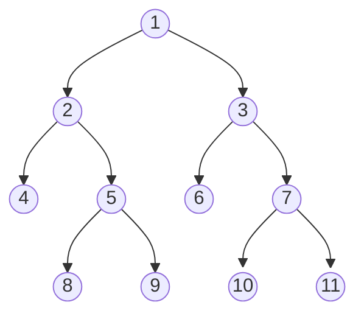
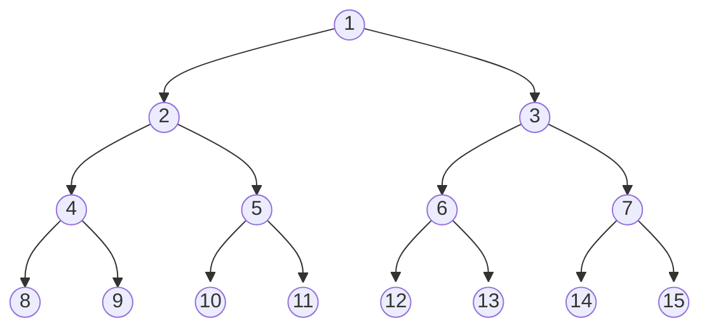
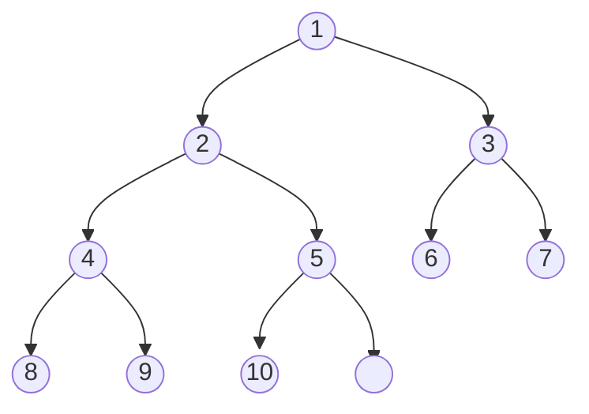

# 树

[[TOC]]

## 1. 基础概念

### 1.1 无根树

*@def* **树**（tree）是由 $n$（$n > 0$）个有限结点组成一个具有层次关系的集合。如果指定一个根结点，那么树要求有下列性质：

- 除了根结点外，每个子结点可以分为零或多个不相交的子树
- 每个结点都只有有限个子结点或无子结点

根据上述性质，树也可以被定义为有 $n$ 个结点，$n-1$ 条边的连通无向图。

*@def* 一个没有固定根结点的树称为 **无根树**（unrooted tree）。指定一个结点称为 **根**（root），则形成一棵 **有根树**（rooted tree）。有根树也可以表示为有向图。

下面的定义既适用于无根树，也适用于有根树。

- *@def* **森林**（forest）：每个连通分量（连通块）都是树的图。按照定义，森林即 $m$（$m > 0$）棵树，一棵树也是森林
- *@def* **生成树**（spanning tree）：一个连通无向图的生成子图，同时要求是树。也即在图的边集中选择 $n - 1$ 条，将所有顶点连通
- *@def* **叶结点**（leaf node）：度数不超过 $1$ 的结点，此处的度定义为图的度，若是有向图则是入度和出度

### 1.2 有根树

本文主要讨论有根树，若上下文没有明确指明，则默认指代的是有根树。下面的定义应用于有根树。

结点的概念：

- *@def* **结点的度**（degree）：结点拥有子树的数量
- *@def* **叶子结点**（leaf node）：没有孩子的结点成为叶子结点，也叫 **终端结点**
- *@def* **分支结点**（branch node）：不是叶子结点的结点，也叫 **非终端结点**

结点和结点的关系：

- *@def* **根结点**（root）：树的最上层的结点，任何非空的树都有一个结点
- *@def* **路径**（path）：从起始结点到终止结点经历过的边
- *@def* **父结点**（parent）：除了根结点，每个结点的上一层边连接的结点就是它的父结点，也叫
- *@def* **子结点**（children）：每个结点由边指向的下一层结点
- *@def* **兄弟结点**（siblings）：同一个父结点并且处在同一层的结点
- *@def* **堂兄弟结点**(cousins)：父结点在同一层的结点互为堂兄弟
- *@def* **子树**（subtree）：每个结点包含它所有的后代组成的子树
- *@def* **祖先结点**（ancestor）：从根到该结点上的任意结点
- *@def* **后代结点**（descendant）：该结点子树的任意结点

树的一些概念：

- *@def* **结点深度**（depth）：到根结点的路径上的边数
- *@def* **树的高度**（height）：所有结点的深度的最大值加一
- *@def* **树的宽度**（width）：包含最多结点的层级的结点数
- *@def* **树的大小**（size）：树的结点总数
- *@def* **无序树**：子树是没有次序排列的，否则是 **有序树**
- *@def* **二叉树**（binary tree）：是一种简单的树，它的每个结点最多只能包含两个子结点
- *@def* **N 叉树**（N-ary tree）：N 叉树的每个结点可最多包含 N 个子树

### 1.3 二叉树的性质

二叉树每个结点最多只能包含两个子结点。一般情况下二叉树指的是有序的二叉树，左右结点不可交换。

二叉树具有如下性质：

1. 二叉树的第 $i$ 层最多有 $2^{i-1}$ 个节点
2. 深度为 $k$ 的二叉树最多有 $2^k-1$ 个节点
3. 任意二叉树 $T$ ，终端节点数为 $n_0$ ，度为 $2$ 的节点数为 $n_2$ ，那么 $n_0 = n_2 + 1$
4. 具有 $n$ 个节点的完全二叉树的深度为 $\lfloor\log_2n\rfloor + 1$

下面是一些特殊的二叉树：

*@def* **满二叉树**（full binary tree）：如果每个内部结点（非叶结点）都包含两个子结点，就成为满二叉树，示例如下。



*@def* **完美二叉树**（perfect binary tree）：当所有的叶子结点都在同一层就是完美二叉树，毫无间隙填充了最低层，示例如下。



*@def* **完全二叉树**（complete binary tree）：当只有最下面两层结点的度数可以小于 $2$，并且最底层的槽被毫无间隙地从左到右填充，我们就叫它完全二叉树，示例如下。



## 2. 树的储存结构

### 2.1 父结点表示法

使用数组保存结点，结点保存父结点的位置。利用除了根结点以外的所有结点都有父结点这一性质，容易找到父结点，但要找到子结点必须遍历整个数组。其定义如下：

::: code-tabs#code

@tab cpp

```cpp
const int m = 10;
struct Node {
    int val, parent;
};
Node tree[m];
```

@tab python

```python
class Node:
    def __init__(self, val: int, parent: int):
        self.val = val
        self.parent = parent
```

:::

### 2.2 子结点表示法

只能从根结点遍历得到其子结点，不能找到父结点，而且子结点的个数有限制。其定义如下：

::: code-tabs#code

@tab cpp

```cpp
struct Node {
    int val;
    Node* children;
};
Node tree;
```

@tab python

```python
class Node:
    def __init__(self, val: int, children: 'list[Node]' = None):
        self.val = val
        self.children = children if children else []
```

:::

### 2.3 父亲孩子表示法

也称为 **树型双链表** 结构，每个结点有两个指针域。其定义如下：

::: code-tabs#code

@tab cpp

```cpp
const int m = 10;
struct Node {
    int val;
    Node* children[m];
    Node* father;
}
```

@tab python

```python
class Node:
    def __init__(self, val: int, children: 'list[Node]' = None):
        self.val = val
        self.children = children if children else []
```

:::

### 2.4 孩子兄弟表示法

也称为 **二叉树型表示法**，它是一种树型双链表结构，每个结点包含一个数据域和两个指针域，一个指向子结点，另一个指向兄弟结点。其定义如下：

::: code-tabs#code

@tab cpp

```cpp
struct Node {
    int val;
    Node* child, next;
}
```

@tab python

```python
class Node:
    def __init__(self, val: int, nextnode: 'Node' = None):
        self.val = val
        self.nextnode = nextnode
```

:::
