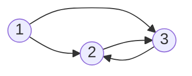

# 图论

## 1. 图的定义

*@def* 点用边连接起来就是 **图**（Graph），图是一种数据结构，定义为：

$$
G = \left(V,\,G\right)
$$

$V$ 是一个非空点有限的集合，代表 **顶点**（Vertex） 的集合，$E$ 代表 **边**（Edge）的集合。

::: info 名词解释

顶点和 **结点**（Node），甚至有些地方出现的 **节点**，在图论中含义是一致的。

:::

## 1.2 基本概念

下面是图的一些相关概念：
- *@def* **有向图**：图的边有方向，只能按箭头方向从一点到另一点
- *@def* **无向图**：图的边没有方向，可以双向
- *@def* **结点的度**：在无向图中，以这个结点为终点的有向边的数目
- *@def* **结点的入度**：在有向图中，以这个结点为起点的有向边的数目
- *@def* **结点的出度**：在有向图中，以这个结点为起点的有向边的数目
- *@def* **权值**：边的长度或者花费
- *@def* **连通**：如果结点 $u,\,v$ 存在一条从 $u$ 到 $v$ 的路径，那么 $u,\,v$ 是连通的
- *@def* **回路**：起点和终点相同的路径
- *@def* **完全图**：一个 $n$ 阶完全无向图含有 $n(n-1)/2$ 条边，一个 $n$ 阶完全有向图含有 $n(n+1)$ 条边
- *@def* **稠密图**：一个边数接近完全的图
- *@def* **稀疏图**：一个边数远远少于完全的图
- *@def* **强连通分量**：有向图中任意两点都连通的最大子图
- *@def* **网络**：带权图称为 **网**（Network）
- *@def* **弧**（Arc）：表示从 $u$ 到 $v$ 的一条弧，其中有方向的弧组成的图是有向图
    - *@def* $u$ 为 **弧头**（Head）或 **终端点**（Terminal node）
    - *@def* $v$ 为 **弧尾**（Tail）或 **初始点**（Initial node）

## 2. 图的存储结构

### 2.1 邻接矩阵存储

定义 $G[n][n]$ 储存一个图，用数学表达即为 $G^{n \times n}$，这是一个方阵，表明该图有 $n$ 个顶点。

$G[i][j]$ 的值表示从 $i$ 到 $j$ 的权值。当 $i,\,j$ 之间没有边或弧时，$G[i][j]$ 可以根据需要定义为 $0$ 或 $\infty$。

对于无向图，$G[i][j] = G[j][i]$ 。对于有向图，$i,\,j$ 的顺序总是行、列，也就是矩阵的第 $i$ 行第 $j$ 列表示从 $i$ 到 $j$ 的权值。

例如：



上图表示为邻接矩阵为：

$$
G = \begin{bmatrix}
    0 & 1 & 1 \\
    0 & 0 & 1 \\
    0 & 1 & 0
\end{bmatrix}
$$

### 2.2 邻接表储存

图的邻接表储存，又叫链式储存法，大多数情况下只需要使用数组实现即可。

邻接表的基本定义如下：

::: code-tabs#code

@tab cpp

```cpp
struct Edge {
    int next;
    int to;
    int dis;
};
Edge edge[100];
```

@tab python

```python
class Edge:
    def __init__(self, next: int, to: int, dis: int) -> None:
        self.next = next
        self.to = to
        self.dis = dis
```

:::

在 C++ 中，一般定义数组使用 C 类型的数组，除非在需求复杂、效率要求不高的场合可以使用 `vector<>` 类型。

## 3. 图的遍历

### 3.1 深度优先遍历

从图的某一个顶点出发系统地访问图中的所有顶点，使得每个顶点恰好被访问一次，这个操作叫做图的遍历。

深度优先搜索算法要求我们遍历每一个结点，因为不是每一个结点都能遍历得到整张图，如果是无向连通图可以只遍历一个结点。

即为深度优先搜索算法：

```python
def dfs(i: int) -> None:
    visited[i] = True
    for j in range(num[i]):
        if not visited[g[i][j]]:
            dfs(g[i][j])
```

### 3.2 广度优先遍历

即为广度优先搜索算法，使用队列即可。通常在图论问题上，广度搜索并不常用，大多数情况下我们首先考虑深度搜索。

### 3.3 一笔画问题

*@def* **欧拉回路**：存在一个结点，使得从这个结点开始进行一次遍历，每条边都经过一次，最后回到起点，那么这个图存在欧拉回路，满足上述条件的一条路径是 **欧拉回路**。

*@def* **欧拉通路**：存在一个结点，使得从这个结点开始进行一次遍历，每条边都经过一次，不要求最后回到起点，那么这个图存在欧拉通路，满足上述条件的一条路径是 **欧拉通路**。

**一笔画定理（欧拉回路定理）**：
- 存在欧拉通路的充要条件是图是连通的且有不超过两个奇点
- 存在欧拉回路的充要条件是图是连通的且不存在奇点

奇点被定义为度为奇数的结点。

根据一笔画定理，要寻找欧拉通路，只需要从任意一点深度优先遍历即可。如果要寻找欧拉回路，只需要从奇点深度优先遍历即可。时间复杂度为 $O(m+n)$，其中 $m$ 为边数，$n$ 为点数。

### 3.4 哈密尔顿回路

*@def* **哈密尔顿回路** 是不重复地走过所有点，最后还能回到起点的路径。**哈密尔顿通路** 则是这样的一条路，能够不重复地走完所有点，哈密尔顿通路不要求最后回到起点。

使用深度优先搜索查找哈密尔顿回路。
