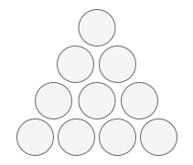

# 费马多边形定理

## 1. 多边形数

*@def* **多边形数** 是可以排成正多边形的整数。例如 $10$ 可以排成三角形：

::: center

:::

$1$ 是任何多边形数的第一项。

第 $n$ 个 $s$ 边型数的公式是

$$
\frac{n \left[
    \left(s-2\right)n-\left(s-4\right)
\right]}{2}
$$

## 2. 费马多边形定理

费马多边形数定理说明，每一个正整数最多可以表示为 $n$ 个 $n$ 边形数的和。也就是说，每一个数最多可以表示为三个三角形数之和、四个平方数之和、五个五边形数之和，依此类推。

一个三角形数的例子，是 $17 = 10 + 6 + 1$。

## 3. 四平方和定理

这是费马多边形定理的一个特例，任意一个正整数都可以被表示为至多 $4$ 个正整数的平方和。

当且仅当 $n \neq 4^k \cdot \left(8m + 7\right)$ 时，$n$ 可以被表示为至多 $3$ 个正整数的平方和。

因此，当 $n = 4^k \cdot \left(8m + 7\right)$ 时，它只能被 $4$ 个数的平方和表示。

## 4. 完全平方和问题

给定正整数 $n$，找到若干个完全平方数（比如 $1,\,4,\,9,\,16,\,\cdots$）使得它们的和等于 $n$。你需要让组成和的完全平方数的个数最少。

给你一个整数 $n$，返回和为 $n$ 的完全平方数的最少数量。

### 4.1 四平方和定理解答

1. 答案为 $1$ 时，则必有 $n$ 为完全平方数
2. 答案为 $2$ 时，则有 $n=a^2+b^2$，我们只需要枚举所有的 $a(1 \leqslant a \leqslant \sqrt{n})$，判断 $n-a^2$ 是否为完全平方数

时间复杂度为 $\mathcal{O}(\sqrt{n})$，空间复杂度为 $\mathcal{O}(1)$。
::: code-tabs#code

@tab cpp

```cpp
class Solution {
public:
    // 判断是否为完全平方数
    bool isPerfectSquare(int x) {
        int y = sqrt(x);
        return y * y == x;
    }

    // 判断是否能表示为 4^k*(8m+7)
    bool checkAnswer4(int x) {
        while (x % 4 == 0) {
            x /= 4;
        }
        return x % 8 == 7;
    }

    int numSquares(int n) {
        if (isPerfectSquare(n)) {
            return 1;
        }
        if (checkAnswer4(n)) {
            return 4;
        }
        for (int i = 1; i * i <= n; i++) {
            int j = n - i * i;
            if (isPerfectSquare(j)) {
                return 2;
            }
        }
        return 3;
    }
};
```

@tab python

```python
class Solution:
    def is_square(self, n: int) -> bool:
        '''
        判断是否为完全平方数
        '''
        return int(sqrt(n + 0.1)) ** 2 == n

    def is_four(self, n: int) -> bool:
        '''
        判断是否能表示为 4^k*(8m+7)
        '''
        while n & 3 == 0:
            n >>= 2
        return n & 7 == 7

    def numSquares(self, n: int) -> int:
        if self.is_square(n):
            return 1
        if self.is_four(n):
            return 4
        i = 1
        while i * i <= n:
            if self.is_square(n - i * i):
                return 2
            i += 1
        return 3
```

:::

### 4.2 动态规划

这是一个典型的 *完全背包* 问题。

定义 $\mathrm{dp}[i]$ 是和为 $i$ 的完全平方数的最小数量，那么

$$
\mathrm{dp}[i] = 1 + \min_{j=1}^{\left\lfloor\sqrt{i}\right\rfloor} \mathrm{dp}[i-j^2]
$$

时间复杂度 $\mathcal{O}(n\sqrt{n})$，空间复杂度 $\mathcal{O}(n)$。

::: code-tabs#code

@tab cpp

```cpp
class Solution {
public:
    int numSquares(int n) {
        vector<int> f(n + 1);
        for (int i = 1; i <= n; i++) {
            int minn = INT_MAX;
            for (int j = 1; j * j <= i; j++) {
                minn = min(minn, f[i - j * j]);
            }
            f[i] = minn + 1;
        }
        return f[n];
    }
};
```

@tab python

```python
class Solution:
    def numSquares(self, n: int) -> int:
        dp = [inf] * (n + 1)
        dp[0] = 0
        for i in range(n+1):
            j = 1
            while (sq := j * j) <= i:
                dp[i] = min(dp[i - sq] + 1, dp[i])
                j += 1
        return dp[n]
```

:::

## 5. 费马平方和定理

奇质数能表示为两个平方数之和的充分必要条件是该素数被 $4$ 除余 $1$。

换句话说，一个非负整数 $c$ 如果能够表示为两个整数的平方和，当且仅当 $c$ 的所有形如 $4k + 3$ 的质因子的幂均为偶数。

可以参考 [证明](https://wstein.org/edu/124/lectures/lecture21/lecture21/node2.html)。
